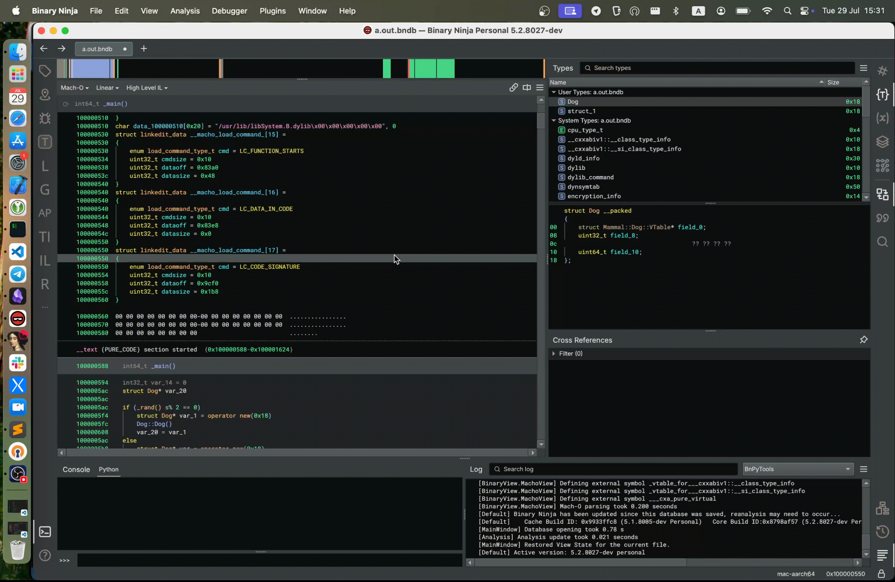
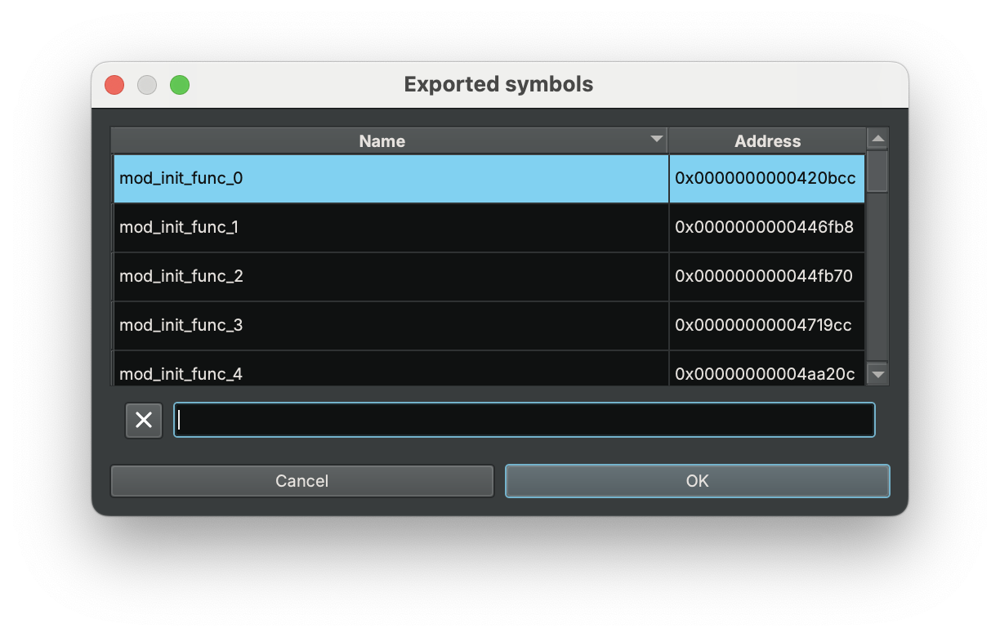

BnPyTools
=========

* [About](#about)
* [Features](#features)
    * [Toggle constancy](#toggle-constancy)
    * [Remove return type](#remove-return-type)
    * [Create virtual table](#create-virtual-table)
    * [Resolve virtual call](#resolve-follow-virtual-call)
    * [Open file location](#open-file-location)
    * [Show switch cases](#show-cases-of-switch)
    * [Show exported symbols](#show-exports)

## About
This plugin is inspired by [HexRaysPyTools](https://github.com/igogo-x86/HexRaysPyTools). BnPyTools is a bunch of quality-of-life features, that I found to be useful in reversing routines.

## Features

### Toggle constancy
Toggle (switch) constancy of the local or data variables. However i prefer to call this feature - Constantine.

### Remove return type
Set return type of current function to `void`.

### Create virtual table
Create virtual table at given address.

### Resolve (follow) virtual call
Extract address from virtual table field and jump to callee fucntion address.

### Open file location
Open file directory in system file-explorer.
> [!NOTE]
> Currently implemented only for macOS.

### Show cases of switch
Show all the case-expressions of the switch-expresion

### Show exported symbols
Simple widget to quickly go through exported symbols of the binary, with searching and sorting features.

